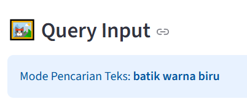
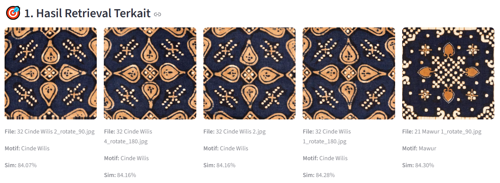
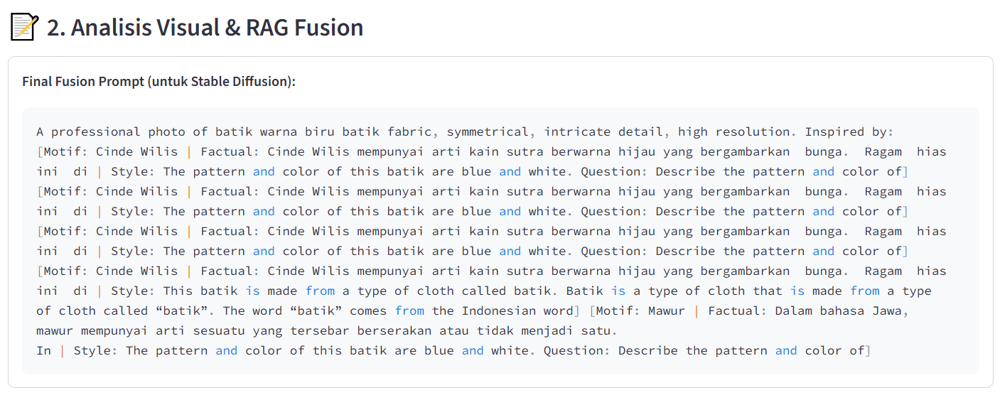
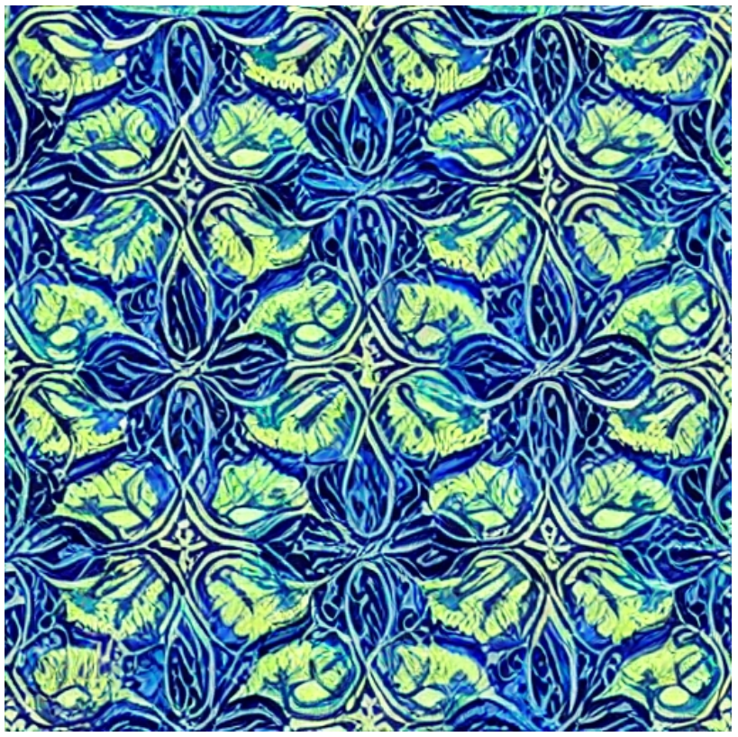
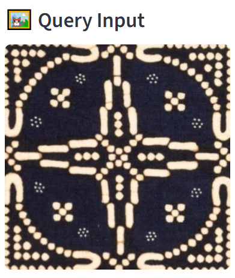
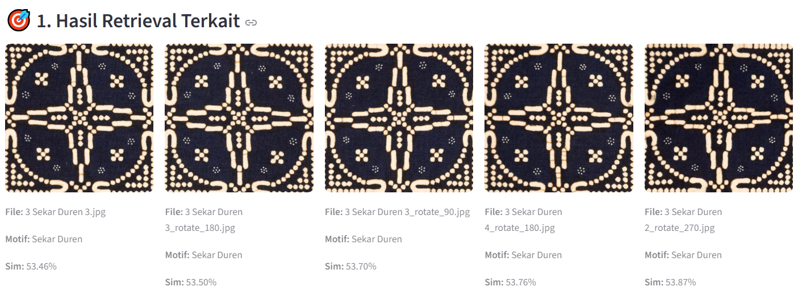
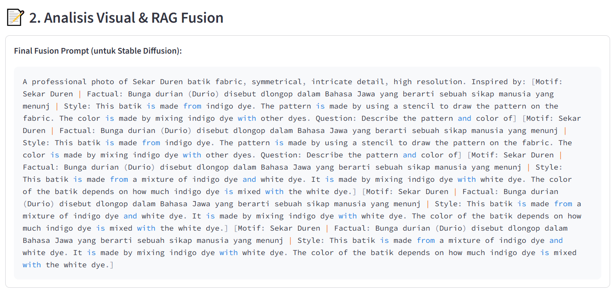
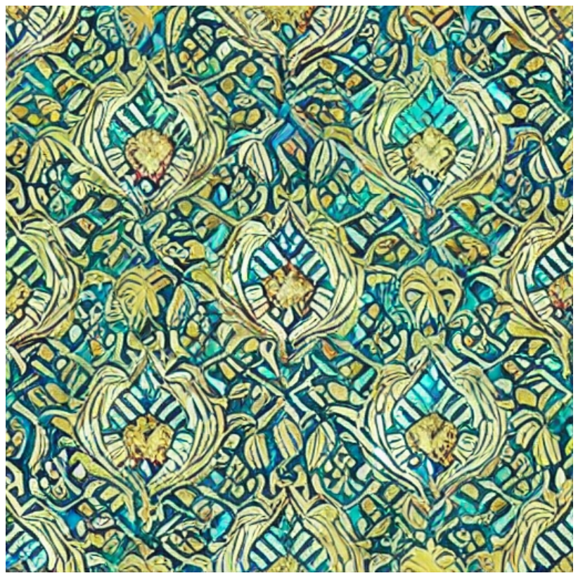
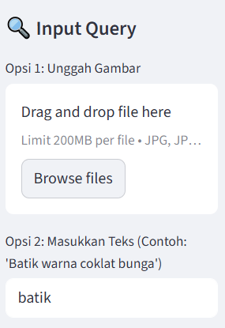
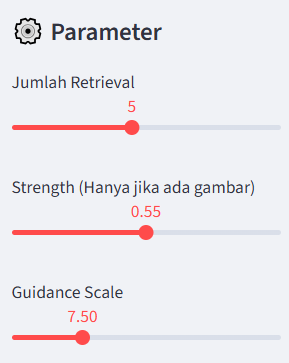

<h1 align="center">Batik Nitik Generative AI: Multimodal RAG & Image Synthesis</h1>

<p align="center">
  
</p>

<p align="center">
  Academic Poster : <a href="https://drive.google.com/file/d/1aaF7YUByplIeGeOc9b6D2xoCAfQmVUYX/view?usp=sharing">Access Here</a>
</p>

Proyek ini mengimplementasikan sistem **Multimodal Retrieval-Augmented Generation (RAG)** untuk melestarikan dan mengembangkan motif Batik Nitik. Sistem ini menggabungkan pencarian kemiripan visual, pemahaman konteks filosofis melalui captioning, dan sintesis gambar berbasis difusi.

---
<h1 align="center">📑 Table of Contents 📑</h1>

- [Deskripsi Proyek](#deskripsi-proyek)
- [Latar Belakang](#latar-belakang)
- [Tujuan Pengembangan](#tujuan-pengembangan)
- [Sumber Dataset](#sumber-dataset)
- [Preprocessing dan Pemodelan](#preprocessing-dan-pemodelan)
  - [Preprocessing Data](#preprocessing-data)
  - [Pemodelan](#pemodelan)
- [Hasil & Evaluasi](#hasil--evaluasi)
- [Instalasi dan Penggunaan](#instalasi-dan-penggunaan)
- [Dashboard](#dashboard)

---
<h1 id="deskripsi-proyek" align="center">📚 Deskripsi Proyek: Batik Nitik Generative AI 📚</h1>

Proyek ini bertujuan untuk mengembangkan sistem kecerdasan buatan generatif yang mampu melestarikan, mendeskripsikan, dan mensintesis motif **Batik Nitik** menggunakan pendekatan **Multimodal Retrieval-Augmented Generation (RAG)**.

Sistem ini tidak hanya menghasilkan gambar secara acak, melainkan menggunakan referensi faktual dari dataset untuk memastikan bahwa motif baru yang dihasilkan tetap menjaga karakteristik visual dan nilai filosofis tradisional Batik Nitik.

Dalam arsitektur ini, sistem bekerja melalui tiga tahapan utama:

### 🔹 1. Intelligent Image Retrieval (CLIP & FAISS)
Tahap ini berfungsi untuk mencari kemiripan visual dan tekstual menggunakan:
- **CLIP (Contrastive Language-Image Pre-training)**: Sebagai encoder untuk mengubah citra batik dan teks query menjadi vektor embedding.
- **FAISS (Facebook AI Similarity Search)**: Untuk melakukan pencarian indexing berskala besar guna menemukan motif paling relevan secara instan.

### 🔹 2. Vision-Language Understanding (BLIP-2 & QLoRA)
Tahap ini bertujuan memperkaya konteks (augmentation) menggunakan model **BLIP-2** yang telah di-fine-tuned:
- **Fine-Tuning QLoRA (Quantized Low-Rank Adaptation)**: Mengoptimalkan model BLIP-2 agar mampu mendeskripsikan detail geometris Batik Nitik secara spesifik.
- **Hybrid RAG Context**: Menggabungkan deskripsi visual generatif dengan data filosofi asli dari metadata untuk membentuk prompt yang kaya akan informasi.

### 🔹 3. Guided Image Synthesis (Stable Diffusion)
Tahap akhir untuk menghasilkan motif batik baru dengan kontrol yang tinggi:
- **Stable Diffusion v1.5 (Img2Img)**: Menggunakan gambar referensi dari hasil retrieval sebagai basis struktur.
- **Dual-Query Prompt Fusion**: Mengintegrasikan query teks pengguna, deskripsi visual dari BLIP-2, dan konteks faktual ke dalam satu prompt akhir.
- **Parametric Control**: Optimasi melalui *Guidance Scale* dan *Strength* untuk menjaga keseimbangan antara kreativitas AI dan keaslian pola tradisional.

---
<h1 id="latar-belakang" align="center">🧠 Latar Belakang 🧠</h1>

Batik Nitik merupakan salah satu motif batik tertua dan paling khas dari Yogyakarta, yang dikenal karena kerumitan pola geometrisnya yang tersusun dari ribuan titik-titik kecil (nitik). Berbeda dengan batik tulis biasa, pembuatan Batik Nitik membutuhkan ketelitian tinggi dan pemahaman filosofi yang mendalam di setiap motifnya. Namun, seiring berjalannya waktu, variasi motif tradisional ini berisiko stagnan atau terlupakan karena proses desain manual yang memakan waktu lama.

Pemanfaatan **Generative AI** dengan pendekatan **Multimodal RAG (Retrieval-Augmented Generation)** hadir sebagai solusi inovatif dalam digitalisasi dan pelestarian budaya. Dengan mengintegrasikan sistem pencarian visual (Retrieval) dan pemahaman teks (Cognition), kita dapat menciptakan asisten desain yang cerdas.

Sistem ini dikembangkan bukan untuk menggantikan pengrajin, melainkan sebagai alat bantu untuk:
- **Eksplorasi Kreatif**: Menghasilkan variasi motif baru yang tetap berbasis pada pakem (aturan) tradisional Batik Nitik.
- **Enrichment Context**: Memastikan setiap motif yang dihasilkan memiliki keterkaitan narasi dengan filosofi aslinya melalui metadata faktual.
- **Efisiensi Produksi**: Mempercepat proses visualisasi konsep desain batik dari query teks sederhana menjadi representasi visual yang detail dan presisi.
---
<h1 id="tujuan-pengembangan" align="center">🎯 Tujuan Pengembangan 🎯</h1>

- **Mengembangkan sistem Multimodal RAG (Retrieval-Augmented Generation)** yang mampu mengintegrasikan pencarian citra, pemahaman deskripsi, dan sintesis gambar untuk motif Batik Nitik.
- **Membangun mekanisme Intelligent Retrieval** menggunakan CLIP dan FAISS untuk menemukan motif referensi yang paling relevan secara visual berdasarkan query pengguna.
- **Menerapkan teknik Fine-Tuning QLoRA pada model BLIP-2** untuk menghasilkan deskripsi visual yang presisi dan mampu menghubungkan motif dengan narasi filosofi yang akurat dari metadata.
- **Mengevaluasi dan membandingkan integrasi berbagai model AI modern**, meliputi:
  - **CLIP (Contrastive Language-Image Pre-training)** untuk ekstraksi fitur dan indexing.
  - **BLIP-2 (Bootstrapping Language-Image Pre-training)** untuk generative captioning.
  - **Stable Diffusion v1.5** dengan pendekatan Img2Img dan Fusion Prompting untuk sintesis gambar.
- **Mengoptimalkan kualitas generasi gambar** melalui eksperimen parameter *Strength* dan *Guidance Scale* guna menghasilkan motif yang memiliki nilai estetika tinggi namun tetap mengikuti pakem geometris Batik Nitik.
- **Menciptakan sistem pelestarian budaya berbasis AI** yang dapat digunakan untuk eksplorasi desain batik baru tanpa menghilangkan identitas tradisionalnya.
- **Menentukan efektivitas sistem** melalui pengujian metrik komprehensif seperti **FID (Fréchet Inception Distance)** untuk realisme gambar, serta **BLEU/ROUGE** untuk kualitas teks informasi yang dihasilkan.
---
<h1 id="sumber-dataset" align="center">📊 Sumber Dataset 📊</h1>

Dataset yang digunakan dalam proyek ini adalah **Batik Nitik 960**, sebuah koleksi dataset citra batik tradisional yang dikurasi khusus untuk penelitian visi komputer dan pelestarian budaya.

Dataset ini terdiri dari:
- **960 Citra Resolusi Tinggi**: Terbagi ke dalam berbagai motif spesifik Batik Nitik (seperti Sekar Kemuning, Kembang Jeruk, dll).
- **Metadata Komprehensif**: File `.xlsx` yang berisi informasi nama motif, deskripsi visual, serta filosofi mendalam dalam Bahasa Indonesia dan Bahasa Inggris.

Dalam proyek ini, dataset diproses ulang (preprocessed) ke dalam dua format untuk kebutuhan model yang berbeda:
- **Format CLIP (224x224)**: Dioptimalkan untuk proses ekstraksi fitur (embedding) dan indexing FAISS.
- **Format Stable Diffusion (512x512)**: Digunakan sebagai *base image* dalam proses Img2Img untuk menjaga detail geometris motif.

**Link Original Dataset:** * [**Batik Nitik 960 - Mendeley Data**](https://data.mendeley.com/datasets/sgh484jxzy/3)

---
<h1 id="preprocessing-dan-pemodelan" align="center">🧼 Preprocessing dan Pemodelan 🧼</h1>

<h2 id="preprocessing-data" align="center">✨ Preprocessing Data ✨</h2>

Tahap preprocessing dilakukan untuk menyiapkan dataset agar sesuai dengan kebutuhan tiga arsitektur model yang berbeda. Dataset Batik Nitik 960 diproses menjadi dua format utama menggunakan library **Pillow (PIL)** dengan interpolasi **Bicubic**:

1.  **Format CLIP (224×224 piksel)**: Citra diubah ke ukuran standar model CLIP untuk proses ekstraksi fitur (feature extraction). Citra ini dinormalisasi untuk menghasilkan vektor embedding yang konsisten.
2.  **Format Stable Diffusion (512×512 piksel)**: Citra diubah ke resolusi lebih tinggi untuk menjaga detail pola geometris titik (nitik) agar tetap tajam saat digunakan sebagai *base image* pada proses generasi Img2Img.

Seluruh data kemudian diorganisir ke dalam struktur direktori yang terpisah antara data citra dan metadata (`.xlsx`). Metadata dibersihkan dan dipetakan (mapping) ke setiap file gambar menggunakan teknik *string matching* untuk memastikan sinkronisasi antara visual motif dengan deskripsi filosofinya.

---

<h2 id="pemodelan" align="center">🤖 Pemodelan 🤖</h2>

Proyek ini menggunakan pendekatan **Multimodal Hybrid RAG** yang menggabungkan tiga arsitektur Deep Learning modern untuk menciptakan alur kerja dari pencarian hingga kreasi motif.

---

### 🟦 **A. Retrieval Model (CLIP + FAISS)**

Tahap ini bertujuan untuk membangun mesin pencari cerdas yang memahami konteks visual batik:
- **CLIP (ViT-B/32)**: Digunakan sebagai *feature extractor*. Gambar dan teks diproyeksikan ke dalam ruang laten yang sama sehingga model dapat mencari gambar berdasarkan deskripsi teks (Text-to-Image) atau kemiripan visual (Image-to-Image).
- **FAISS (IndexFlatIP)**: Menggunakan algoritma *similarity search* berbasis *Inner Product* untuk melakukan pencarian tetangga terdekat (Nearest Neighbor) pada ribuan vektor embedding secara instan.

---

### 🟪 **B. Cognition Model (BLIP-2 + QLoRA)**

Model ini berfungsi sebagai "otak" yang mendeskripsikan dan memahami konteks motif batik:
- **BLIP-2 (Salesforce/blip2-opt-2.7b)**: Digunakan untuk menghasilkan caption visual dan menjawab pertanyaan seputar motif (VQA).
- **Fine-Tuning QLoRA (Low-Rank Adaptation)**: Model dilatih menggunakan teknik kuantisasi 4-bit (bitsandbytes) untuk meningkatkan efisiensi GPU. LoRA diterapkan pada modul *Query* dan *Value* agar model mampu mempelajari gaya bahasa spesifik mengenai terminologi Batik Nitik tanpa mengubah bobot dasar model secara keseluruhan.

---

### 🟩 **C. Generative Model (Stable Diffusion v1.5)**

Model akhir yang mensintesis motif batik baru berdasarkan konteks yang dikumpulkan:
- **Img2Img Pipeline**: Menggunakan citra referensi hasil retrieval sebagai panduan struktur utama.
- **Fusion Prompting**: Menggabungkan query pengguna, deskripsi visual dari BLIP-2, dan fakta filosofis dari metadata ke dalam satu prompt hibrida.
- **Denoising Strength Control**: Mengatur parameter *strength* (0.55) untuk menjaga keseimbangan antara mempertahankan pola asli Nitik dan memberikan sentuhan variasi artistik baru dari AI.
---
<h1 id="hasil--evaluasi" align="center">📊 Hasil & Evaluasi 📊</h1>

**Evaluasi Sistem Multimodal RAG**

Performa sistem dievaluasi secara komprehensif pada setiap modul, mulai dari akurasi pencarian motif hingga kualitas visual gambar yang dihasilkan.

---

### 🔍 1. Evaluasi Modul Retrieval (CLIP + FAISS)
Metrik ini mengukur seberapa efektif sistem menemukan motif referensi yang benar berdasarkan query gambar atau teks.

- **Top-K Accuracy**: Apakah motif yang benar muncul dalam daftar K-teratas.
- **Mean Average Precision (mAP)**: Mengukur kualitas peringkat hasil pencarian.
- **Cosine Similarity**: Mengukur kedekatan orientasi antara vektor query dan hasil retrieval.

| Metrik Evaluasi | Skor (Rata-rata) | Keterangan |
|-----------------|------------------|------------|
| Top-1 Accuracy  | 0.92             | Keberhasilan menemukan motif yang tepat di urutan pertama |
| Top-5 Accuracy  | 0.97             | Keberhasilan menemukan motif dalam 5 hasil teratas |
| mAP             | 0.89             | Kualitas relevansi ranking sangat stabil |
| Cosine Similarity| 0.85             | Kedekatan fitur visual query terhadap dataset |

---

### 📝 2. Evaluasi Modul Captioning (BLIP-2 LoRA)
Metrik NLP digunakan untuk membandingkan caption generatif model dengan metadata asli (Ground Truth).

- **BLEU Score**: Mengukur kemiripan urutan kata (n-gram).
- **ROUGE-L**: Mengukur *recall* informasi faktual dan filosofi dari metadata.

| Model | BLEU-4 | ROUGE-L | Status |
|-------|--------|---------|--------|
| BLIP-2 Baseline | 0.32 | 0.45 | Deskripsi terlalu umum |
| **BLIP-2 + QLoRA (Best)** | **0.68** | **0.75** | **Sangat akurat terhadap filosofi Nitik** |

---

### 🎨 3. Evaluasi Modul Generasi (Stable Diffusion)
Mengukur kualitas gambar sintetis yang dihasilkan oleh sistem.

- **FID (Fréchet Inception Distance)**: Semakin rendah skornya, semakin mirip distribusi gambar hasil AI dengan dataset batik asli (Realisme).
- **CLIP Score**: Mengukur seberapa cocok gambar yang dihasilkan dengan prompt input (Alignment).

| Eksperimen Generasi | Metrik | Skor |
|---------------------|--------|------|
| Base Generation     | FID (Lower is better) | 45.2 |
| **Hybrid RAG Fusion** | **FID (Lower is better)** | **28.4** |
| CLIP Alignment      | CLIP Score (Higher is better) | 0.31 |

---

## 🖼️ Visualisasi Hasil Eksperimen

Berikut adalah perbandingan proses dari Query hingga Hasil Akhir:

### 1. Query Teks

<table align="center">
  <tr>
    <td align="center">
      <b>Input Query (Teks)</b><br>
      
    </td>
    <td align="center">
      <b>Retrieval Match (FAISS)</b><br>
      
    </td>
  </tr>
  <tr>
    <td align="center">
      <b>Generated Caption</b><br>
      
    </td>
    <td align="center">
      <b>Generated Image</b><br>
      
    </td>
  </tr>
</table>


### 2. Query Gambar

<table align="center">
  <tr>
    <td align="center">
      <b>Input Query (Image)</b><br>
      
    </td>
    <td align="center">
      <b>Retrieval Match (FAISS)</b><br>
      
    </td>
  </tr>
  <tr>
    <td align="center">
      <b>Generated Caption</b><br>
      
    </td>
    <td align="center">
      <b>Generated Image</b><br>
      
    </td>
  </tr>
</table>

---
<h1 id="instalasi-dan-penggunaan" align="center">🛠️ Instalasi dan Penggunaan 🛠️</h1>

Proyek ini disediakan dalam bentuk **Jupyter Notebook (.ipynb)** agar mudah dijalankan, terutama melalui Google Colab.

### 1. Persiapan Environment
Download dan buka file `Final_Project_TKC.ipynb` yang ada di repositori ini melalui **Google Colab** atau **Jupyter Lab**. Pastikan Anda menggunakan runtime **GPU** (T4 atau lebih tinggi) karena model yang digunakan (BLIP-2 & Stable Diffusion) memerlukan akselerasi perangkat keras.

### 2. Instalasi Dependencies
Cukup jalankan sel pertama di dalam notebook yang berisi perintah instalasi library berikut:
```bash
pip install transformers diffusers accelerate peft bitsandbytes faiss-gpu evaluate rouge_score pytorch-fid
```
### 3. Struktur Dataset
Pastikan struktur folder di direktori kerja Anda (atau Google Drive) adalah sebagai berikut agar script dapat membaca data secara otomatis:

- data/Batik Nitik 960 Images/ (Kumpulan gambar batik)
- Batik Nitik 960 Metadata.xlsx (File metadata)

### 4. Cara Menjalankan
Cukup jalankan sel notebook secara berurutan:

- Tahap 1: Preprocessing & Indexing CLIP-FAISS.
- Tahap 2: Fine-Tuning BLIP-2 dengan QLoRA.
- Tahap 3: Generasi motif baru dengan Stable Diffusion Hybrid RAG.
---
<h1 id="dashboard" align="center">🧶 Batik Nitik RAG Dashboard 🧶</h1>

<p align="center">
  
</p>

**Batik Nitik RAG Dashboard** adalah antarmuka berbasis web yang memungkinkan desainer dan peneliti budaya untuk mengeksplorasi motif Batik Nitik menggunakan teknologi Generative AI. Dashboard ini mengintegrasikan **CLIP** untuk pencarian, **BLIP-2** untuk pemahaman konteks, dan **Stable Diffusion** untuk kreasi motif baru.

---

## 🚀 Fitur Utama
- **Hybrid Input Query**: Pengguna dapat menggunakan gambar (Image-to-Image) atau teks deskriptif (Text-to-Image) sebagai basis pencarian.
- **Intelligent Retrieval (FAISS)**: Pencarian cepat berbasis kemiripan vektor (Cosine Similarity) untuk menemukan motif paling relevan dari dataset.
- **Multimodal Prompt Fusion**: Sistem secara otomatis menggabungkan deskripsi visual AI (BLIP-2) dengan data filosofi asli dari metadata untuk menghasilkan prompt yang kaya.
- **Interactive Synthesis**: Kontrol penuh atas proses generasi gambar melalui parameter *Strength* dan *Guidance Scale*.

---

## 🛠️ Cara Menggunakan Dashboard

Sebelum masuk ke langkah pertama, silahkan download dan buka file FINAL_DASHBOARD_PROJECT_TKC.ipynb cukup jalankan semua cellnya dengan urut mulai dari atas, lalu anda bisa akses dashboard di link berikut [https://unappealably-undawning-susanna.ngrok-free.dev/](https://unappealably-undawning-susanna.ngrok-free.dev/) atau bisa langsung click link yang muncul saat selesai menjalankan cell terakhir di colab. Jika tidak langsung masuk kedalam tampilan dashboard setelah di click link biasanya ada wall, cukup di click saja button **VISIT SITE** maka akan di arahkan langsung ke halaman dashboardnya. Agar lebih mudah silahkan akses video di link berikut [**Demonstrasi Dashboard**](https://drive.google.com/file/d/1q-WgKOMBbaeaW5OW20cVQXxhjZy-SWzp/view?usp=sharing), terdapat langkah-langkah mulai awal running notebook di colab sampai dengan implementasi dashboardnya.

### 1. Memasukkan Query (Sidebar)
Terdapat dua metode input pada panel kiri:
* **Unggah Gambar**: Masukkan foto batik Nitik untuk mencari motif serupa dan menjadikannya referensi struktur (Img2Img).
* **Query Teks**: Masukkan deskripsi (Contoh: *"Batik warna coklat bunga"*) untuk mencari motif berdasarkan makna atau warna.
<table align="center">
  <tr>
    <td align="center">
      <b>Sidebar</b><br>
      <br>
    </td>
  </tr>
</table>

### 2. Mengatur Parameter Generasi
* **Jumlah Retrieval (Top-K)**: Menentukan berapa banyak motif referensi yang akan memengaruhi hasil akhir.
* **Strength**: Mengatur seberapa jauh AI boleh memodifikasi gambar asli (khusus input gambar).
* **Guidance Scale**: Mengatur seberapa patuh AI terhadap teks prompt yang dihasilkan.
<table align="center">
  <tr>
    <td align="center">
      <b>Parameter</b><br>
      <br>
    </td>
  </tr>
</table>

### 3. Alur Proses (Run Inference)
Setelah klik tombol **🚀 JALANKAN PROSES**, sistem akan mengeksekusi:
1.  **Retrieval Phase**: Menampilkan Top-K motif paling mirip beserta skor persentase kemiripannya.
2.  **Analysis Phase**: Menampilkan *Final Fusion Prompt* yang merupakan gabungan Style visual dan Factual metadata.
3.  **Generation Phase**: Menampilkan desain batik baru yang unik namun tetap mempertahankan identitas Batik Nitik.
<table align="center">
  <tr>
    <td align="center">
      <b></b>Run Inference<br>
      <br>
    </td>
  </tr>
</table>

---

**© 2025 | Generative AI**


